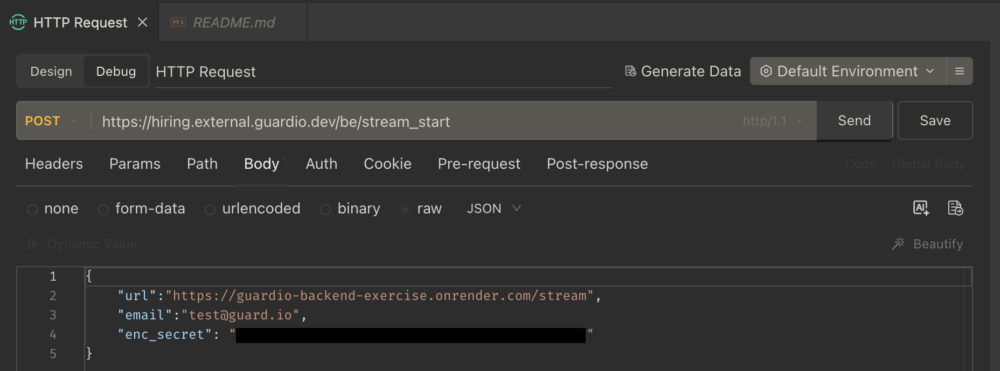
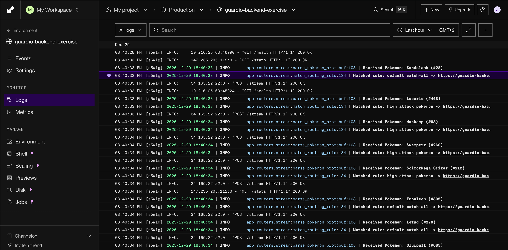

# Request Flow Documentation

This document shows the flow of a request through the Guardio backend system, from the initial POST request to the downstream server logs.

## 1. POST Request to Guardio

The initial POST request being sent to the Guardio proxy server.

## 2. Proxy Server Logs

The proxy server processing the request and forwarding it downstream.

## 3. Downstream Server Logs

The downstream server receiving and processing the forwarded request.

---

## Flow Summary

1. **Client** → Sends POST request to Guardio proxy server
2. **Proxy Server** → Processes request, applies security rules, and forwards to downstream server
3. **Downstream Server** → Receives and processes the request

